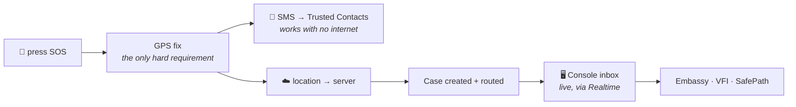

# SafeZone

**Emergency help for Lao travellers abroad.** A phone app that keeps your passport
in an encrypted vault and turns one button press into a rescue, and a web console
where the Embassy, VFI and SafePath pick that call up.

ແອັບຊ່ວຍຄົນລາວໃນຕ່າງປະເທດ: ຕູ້ເຊຟພາສປອດ + ປຸ່ມ SOS

When you are in trouble in a country whose language you don't speak, two things
decide the outcome: **where you are** and **who you are**. SafeZone sends both,
instantly, to the people who can act — and to the one person who will always pick
up, your Trusted Contact.

---

## The two halves

| | | |
|---|---|---|
| [`safezone/`](safezone/) | **Mobile app** | Flutter · Lao UI. Encrypted passport vault + the SOS button. |
| [`safezone-console/`](safezone-console/) | **Response console** | Next.js 14 · Prisma · Supabase. The Embassy/VFI/SafePath case desk. |

Each has its own README with setup steps and permissions. Start there to run
either one.

## What happens when someone presses SOS



**Two independent channels, and neither can abort the other.** A dead server must
never stop the SMS — that is the channel that still works with no connectivity, so
it is the channel of last resort. SOS fails only when there is nothing to send (no
GPS) or nowhere to send it (no contact *and* no server).

Two details the code is careful about, and the UI honours:

- **The passport is deliberately *not* part of the SOS flow.** Sharing it is a
  separate, manual action on the Passport screen. An emergency broadcast is the
  worst possible moment to also be handing out an identity document.
- **"SMS launched" is not "SMS sent."** The OS hands control to the messaging app
  and never reports back what the user did next, so the app does not claim
  otherwise. A partial send is still a send, and the user is told exactly which
  half of it landed.

### Duress

If the user unlocks with their **fake** password — the one you give up when someone
is standing over you — the app sends a silent `DURESS` alert alongside the normal
SOS. The console raises that case to **CRITICAL** so the duty officer knows the
person was coerced. Nothing the attacker holding the phone can see changes.

## Security model

The whole design turns on one guarantee:

> **The passport plaintext only ever lives in memory, or in a short-lived temp file
> during an active share. It is never persisted in plaintext.**

- **AES-256-CBC.** The key is generated once with `Key.fromSecureRandom(32)` and
  stored in the OS keystore via `flutter_secure_storage` — never hard-coded, never
  written to normal storage. Only `passport.enc` reaches disk.
- **The decrypted copy is cleaned up twice over.** Sharing the passport writes a
  transient `passport_share.jpg`, and `PassportScreen` deletes it in a `finally`
  that runs on every path, including early returns. Belt and braces: `main.dart`
  also sweeps the temp dir on startup, so a copy stranded by a crash is wiped
  before any UI appears.
- **The app ships no secrets.** `SupabaseConfig` carries the *publishable* key,
  which is public by design and safe because `sos_events` is write-only under RLS —
  it can insert a location but cannot read one back. The **secret key never goes in
  the app.**
- **You cannot file a case as someone else.** `/api/sos` and `/api/me/*` require a
  Supabase access token carrying a **verified phone claim**; the citizen's identity
  is taken from that claim, never from the request body. (This replaced a shared
  bearer token that had to be compiled into the APK — which meant it wasn't a
  secret at all.)
- **Staff see only their own cases.** `OFFICER`/`ADMIN` see everything; `PARTNER`
  sees only cases routed to their partner.

See [`SafeZone_Security_Improvements.md`](SafeZone_Security_Improvements.md) for the
hardening history — but **verify claims against the code, not the doc**; it has
drifted in places.

## Quick start

Two independent stacks. Neither needs the other to run.

```bash
# The console
cd safezone-console
npm install
npm run db:push        # push the Prisma schema to Supabase
npm run db:seed        # demo partners, citizens, cases
npm run dev            # http://localhost:3000

# The app
cd safezone
flutter create .       # FIRST TIME ONLY — adds android/, ios/; does not touch lib/
flutter pub get
flutter run
```

> **Environment.** The console needs both `.env` and `.env.local` with the same
> values. Next.js reads `.env.local` at runtime; the Prisma CLI reads `.env`. Miss
> one and the app runs fine while every `prisma` command fails, or vice versa.
> Copy [`safezone-console/.env.example`](safezone-console/.env.example) to both.
> Both are gitignored — **never commit real credentials.**

> **Permissions.** After the first `flutter create .`, the Android and iOS
> permissions must be added by hand or the app crashes at runtime. The exact
> snippets are in [`safezone/README.md`](safezone/README.md).

## Repo layout

```
safezone/                 Flutter app
  lib/services/           singletons: crypto, passport vault, contacts, location, SOS
  lib/screens/            home · passport · contact · sos · profile · auth
  lib/config/             Supabase + console endpoints (publishable key only)

safezone-console/         Next.js response console
  prisma/schema.prisma    cases · citizens · partners · responders · staff · sos_events
  src/app/(dashboard)/    dashboard · inbox · cases/[id] · citizens · reports
  src/app/api/            sos intake · cases · /me/* for the mobile app
  supabase/               RLS policies + staff role mapping

*.md, *.docx              planning, security and validation docs
```

## Scope

This is an **MVP built for a demo**. The one flow that matters end-to-end is:
**scan passport → set Trusted Contact → press SOS → the case lands in the console.**
Embassy systems integration is mocked/roadmap. UI strings are Lao throughout — keep
new strings and error messages in Lao to match.
